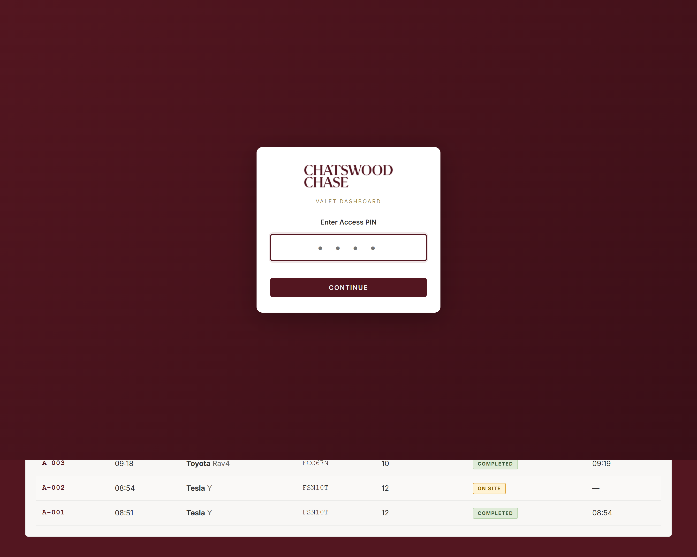
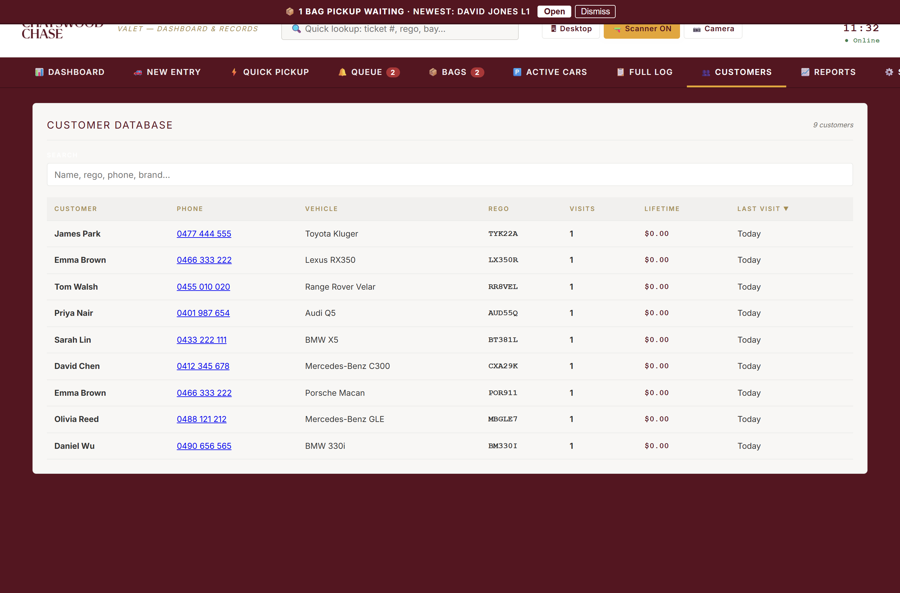
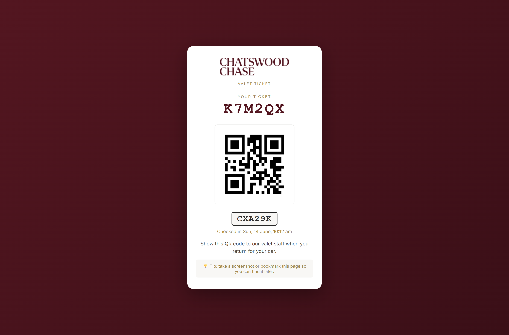

# Chatswood Chase Valet App

A single-page valet operations dashboard for Chatswood Chase's valet service — check cars in and out, take payment, print key tags, text customers their ticket, run hands-free shopping and car wash add-ons, and give management live reports. Built as one HTML file (`index_v2.html`), synced live across every device on a Supabase backend.

- **Live (staff use this one):** https://chatswoodchasevalet.github.io/
- **Fallback:** https://chadmik71.github.io/Valet/
- **Full staff manual:** [`MANUAL.md`](MANUAL.md) (or the printable [`manual.html`](manual.html), also reachable in-app from *Settings → Help & Manual*)

> This README is a features tour with screenshots. For step-by-step "how do I…" instructions, use `MANUAL.md`.

## Contents
[Overview](#overview) · [Check-in](#check-in-new-entry) · [Quick Pickup](#quick-pickup) · [Pickup Queue](#pickup-queue) · [Active Cars](#active-cars) · [Bags — hands-free shopping](#bags--hands-free-shopping) · [Car wash](#car-wash) · [Dashboard](#dashboard) · [Customers](#customers) · [Reports](#reports) · [Settings](#settings) · [Customer ticket page](#customer-ticket-page) · [Other capabilities](#other-capabilities) · [How it was built](#how-it-was-built) · [How to access everything](#how-to-access-everything)

## Overview

- **Cloud-synced** — every device (counter PC, tablets, staff phones) shares live data via Supabase; a car logged on one screen appears on all others within seconds.
- **Works offline** — the app keeps working if the connection drops and syncs automatically once it's back.
- **Installable** — can be added to a tablet's home screen and run full-screen like a native app.
- **Mobile / Desktop modes** — a toggle shows a lean tab set (New Entry, Quick Pickup, Queue, Bags, Active Cars) on phones, and the full manager tab set (+ Dashboard, Customers, Reports, Settings) on the counter PC.
- **Per-staff logins** — every attendant signs in with their own account so parking and returns are credited correctly in reports.

## Check-in (New Entry)

The drop-off form. Ticket number and time-in fill automatically.

- Captures customer name, phone (for the SMS ticket), car brand/model/colour, parking bay, and number plate — either typed or read automatically with the camera (plate OCR).
- **Damage diagram** — tap the car outline to mark existing scratches/dents before parking. If the plate has been seen before, the last visit's marks pre-load automatically so staff can just confirm or update them.
- **Charge to shop**, **VIP** flag, **car wash add-on**, and free-text notes, all from the same form.
- Optional photo + GPS capture at drop-off.
- Saving auto-prints the key tag, texts the customer their QR ticket link, and puts the car on Active Cars / Dashboard everywhere instantly.

## Quick Pickup

Fast lookup to return a car: scan the key tag / QR ticket, or search by ticket, name, plate or bay from the top-bar search on any screen.

A **Lost ticket** flow lets staff find the car by customer details and log the identity check before releasing it.

## Pickup Queue

When a customer asks for their car ahead of time, it goes in the queue with an ETA countdown that changes colour as it gets closer to due (and flags overdue in red). Status can be pushed live to the customer's ticket page ("on its way" / "ready at the desk").

## Active Cars

The full working list of everything on site — ticket, customer, plate, brand, bay, time in, running duration (colour-coded by how long it's been) and fee.

Per-row actions: call the customer, resend the QR ticket, reprint the key tag, edit details, log a bag pickup, add/manage a car wash, view/edit damage marks & notes, put the car in the queue, or check it out. An **overstay banner** flags any car left overnight or past a configurable hour threshold.

**Checkout & payment** (from the ✓ Mark Out action) supports:
- Card / Cash / EFTPOS / Other, Unpaid, Complimentary, or Charge to shop/account
- **Level 1 promotion** — free valet & parking against a validated shop receipt
- Store validations and %/$ discounts
- Tips and fee overrides
- **Square Terminal** integration — send the charge to a paired card terminal; a successful charge auto-checks the car out
- A mandatory **return condition** check (clean vs. new damage/incident, with customer acknowledgement) logged for the record

## Bags — hands-free shopping

Customers leave purchases at stores; valet collects everything and loads the car while it's parked.

- Jobs move through **requested → collecting → in car → done**, and a car can have several rounds running at once (one per shop), each tracked separately.
- Any staff member can claim a job (**I'll get it**); on desktop, a job can instead be **assigned to a specific staff member**, which rings/vibrates their phone and pops an "Assigned to you" alert (plus an OS notification if the app is closed and they have alerts enabled).
- A proof photo is taken in the car when bags are loaded and sent to the customer.
- Both the collector and the loader are credited separately in reports.

## Car wash

Valet can add an on-site car wash from Xtream Car Care and bill it on the same valet ticket.

- Add a wash at check-in or any time while parked; pick package + size (small/large) and the price fills in automatically.
- Track the car's wash status (taken to wash → washed, back) right from Active Cars.
- Wholesale cost per package is set in Settings so the Payments report can show what's owed to Xtream and the margin kept, separate from parking revenue.

## Dashboard

The at-a-glance view of the day for managers and staff alike.

- Stat tiles: cars in, cars out, currently on site, pickups pending, today's revenue (tap to see who paid what), average stay.
- A shared **handover notepad** that auto-clears each morning.
- Top brands and recent activity for the day.
- **Live customer feedback alerts** — a star rating left on a customer's ticket page pops a toast on every open device instantly (flagged red for 3★ or under) and pins a banner until someone reviews it.

## Customers

A searchable database of everyone who's used the valet, built automatically from every visit and keyed by number plate.

- Search by name, plate or phone to see full visit history and total spend; returning customers and VIPs are flagged.
- Every visit's damage record (intake marks, notes, and how the car was returned) is one tap away — useful for handling a damage query about a past visit.

## Reports

Manager analytics across a chosen date range, exportable to CSV or print-ready PDF.

| Report | Covers |
|---|---|
| Management Summary | Centre-facing roll-up: cars, revenue, tips, car wash, validation value, pickup wait SLA, peak occupancy, incidents. Printable one-pager. |
| Daily Volume | Cars/revenue per day, trends, peak times, brand breakdown. |
| Payments | Cash-up, shop accounts, car wash margin, Level 1 promotion usage, discounts. |
| Staff Performance | Cars parked / checked out / revenue / tips per attendant. |
| Customers | Stay-length tiers, repeat customer stats. |
| Customer Feedback | Star ratings and comments from ticket pages. |
| Bag Jobs by Staff | Hands-free shopping jobs and timing per staff member. |
| Period Comparison | This week/month/year vs. last. |
| Incidents | Logged return-condition damage with acknowledgement. |
| Full Log | Every entry, searchable, with damage-record access. |

## Settings

Manager configuration: staff logins & access, car park capacity and overstay alert threshold, retailer list, car wash wholesale pricing, SMS/alert messaging, device setup (key-tag printer, Square Terminal, scanner), and data export/backup.

Other configurable programs (default off, enable per centre as needed):
- **Loyalty program** — every *N* paid valets earns the next one free, auto-applied at checkout.
- **Multi-centre support** — the app can be cloned to a new site by editing one central config block (see `CLONE-NEW-CENTRE.md`).

## Customer ticket page

Every customer gets a link (texted at check-in) to a live ticket page showing their car's status and a QR code, with a spot to leave a star rating and feedback after pickup.

## Other capabilities

- **Number-plate OCR** — camera-read plate at check-in, cloud recognition with an on-device offline fallback.
- **BIXOLON key-tag printing** — auto-prints on check-in via a local WebPrint bridge app; one-tap reprint anytime.
- **ClickSend SMS** — automatic QR ticket text on check-in, and status pushes from the queue.
- **Square Terminal payments** — in-person card charges from checkout, tied to a per-device terminal ID.
- **Entry photos in cloud storage** — bag/car photos are stored in a Supabase Storage bucket (not inlined in the database), keeping the app fast as photo volume grows.

## How it was built

**No build step, no framework.** The entire app is one file — `index_v2.html` — plain HTML, CSS and vanilla JavaScript. There's no `npm install`, no bundler, no compile step: the file that's edited is exactly the file that's served. That keeps it simple to change quickly and easy to run anywhere (open it directly in a browser, or host it as a static file).

**Backend: Supabase.** [Supabase](https://supabase.com) provides everything server-side, so there's no custom backend to run or maintain:
- **Postgres database** — tables `entries`, `staff`, `app_settings`, `audit_log`. Columns are `snake_case`; the frontend converts to/from `camelCase` with `jsToDb()` / `dbToJs()` helpers.
- **Auth** — per-staff logins, plus device-token session refresh so a tablet doesn't have to re-log-in constantly.
- **Row Level Security (RLS)** — policies gate staff-only actions and lock customer PII behind an authenticated session.
- **Realtime** — every device subscribes to live database changes (`postgres_changes`), which is how a car logged on one screen appears on every other screen within seconds.
- **Storage** — bag/car check-in photos are uploaded to a Storage bucket and referenced by a short link, rather than stored inline in the database.
- **Edge Functions** (serverless, deployed to Supabase) — `send-ticket-sms` (texts the QR ticket via ClickSend), `square-terminal-checkout` (sends a charge to a paired Square Terminal), `clicksend-rate` (SMS cost/usage reporting), and a device-token `refresh` function that silently re-authenticates a device without a password prompt.

**Third-party integrations**, called directly from the frontend or an Edge Function: [ClickSend](https://clicksend.com) for SMS, [Square](https://squareup.com) for in-person card payments, and a BIXOLON SPP-R200III key-tag printer driven through a small local **WebPrint bridge app** (the browser can't talk to a receipt printer directly).

**Hosting & deployment.** Static hosting on GitHub Pages, across **two** GitHub repos that both serve the same app — pushing a commit updates the live site in roughly 30–60 seconds, with no CI/CD pipeline in between.

**Timestamps** are stored in UTC in the database and always converted to Sydney local time for display.

**How this app is actually developed:** changes are made by editing `index_v2.html` directly with **Claude Code** (Anthropic's AI coding CLI) as a pair-programmer, committed with `git`, and pushed straight to both live GitHub Pages sites — there's no staging environment, so "push" and "ship" are the same action. Backend changes (schema, RLS policies, Edge Functions, logs) are made through Supabase's dashboard and its developer tools, and UI changes are verified by driving the actual live site in a real browser rather than a local mock.

## How to access everything

| What | How |
|---|---|
| **Use the app (staff/managers)** | Just open it in any browser — no install required: **[chatswoodchasevalet.github.io](https://chatswoodchasevalet.github.io/)** (canonical) or the fallback **[chadmik71.github.io/Valet](https://chadmik71.github.io/Valet/)**. Add to a tablet's home screen for a full-screen app-like experience. |
| **Manager/admin features** | No separate admin panel — Dashboard, Reports and Settings live in the same app, gated behind a staff login (Desktop mode shows the full tab set). |
| **The codebase** | One file, `index_v2.html`, in this repo. Edit it directly — no build/install step — and push to both `origin` and `neworigin` remotes to go live on both sites. |
| **The backend (Supabase)** | Managed through the Supabase project dashboard (project `ebqiitxiyzzbkgyfypss`) — database tables, RLS policies, Storage, Auth, Edge Functions and logs all live there. |
| **SMS (ClickSend)**, **payments (Square)**, **printing (BIXOLON)** | Configured per-device/per-centre from **Settings → Devices** and **Settings → Alerts & Messaging** inside the app itself; API credentials for ClickSend/Square live in Supabase (used by the Edge Functions), not in the frontend. |
| **Full staff instructions** | [`MANUAL.md`](MANUAL.md) / printable [`manual.html`](manual.html) — also reachable in-app from *Settings → Help & Manual*. |

---
*See [`MANUAL.md`](MANUAL.md) for full day-to-day operating instructions, pricing reference, troubleshooting and glossary.*
